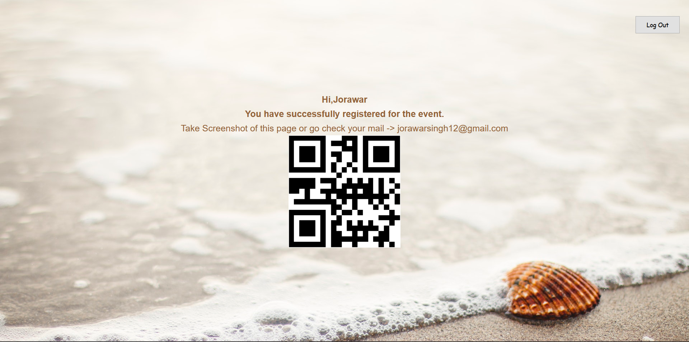
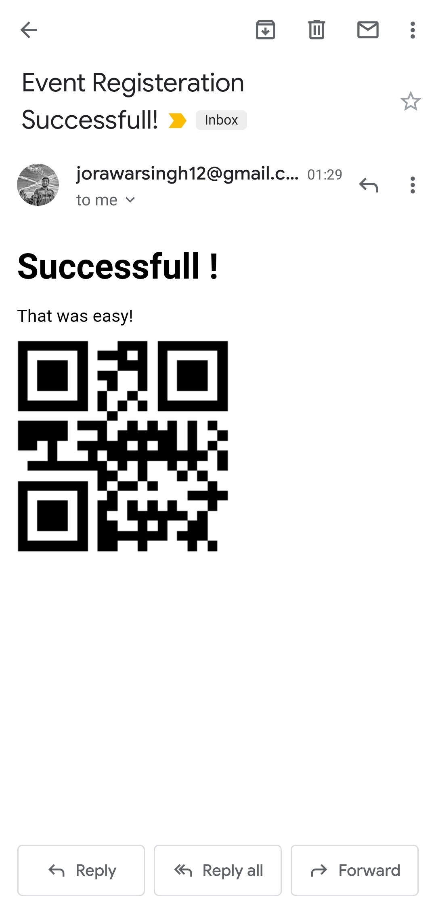

# Event-QR-CODE
The wesite is live at : https://radiant-hamlet-73755.herokuapp.com/
## Register Page

## Login Page

## User Home Page

## Email Sent:

This node application is built with the view to simplify and robust the process of event registeration.

THe steps to register for the event are:
* Register on the register page with username, email-id and password.
* Login with the user-id and password.
* The User Home Page will show the message of successfull registeration along with the bar code which can be scanned.
* The bar code contains information about user's name.
* A mail is also sent to the registerd email with the barcode.
* The bar code can be used at events site for entry and other purposes as well.

Goals for next commit:

* Add user information to database.
* Show number of people who have registered for the same.
* Information related to place of event or link(if it is web only) on the homepage.
* Disable Registeration based after a fixed number of registeration.
* Changes related to cookies to permit single user for session( Issue - delete session of logout user).
